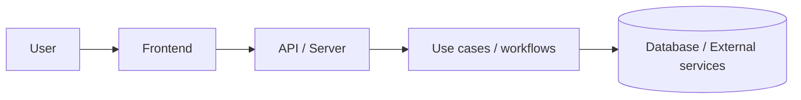

# Architecture

このドキュメントは {project-name} のシステム全体像をまとめる。細かいディレクトリ構造や実装規約は coding-guideline skill を参照する。

## 全体像

{Customize: 実際の構成に合わせて図と説明を更新する。frontend-only / backend-only の場合は不要な node を削る。}

アプリケーションの中心は use case と pure service に寄せる。期待される分岐は例外ではなく ADT-style result として表現し、境界層が UI 表示や HTTP response に写像する。

## 品質戦略

このプロジェクトの中核戦略は、型検査・純粋関数・現実的な軽量テストを組み合わせて信頼性を上げることだ。

- ADT と discriminated union で状態と結果を表現する。
- 純粋関数は I/O から分離して高速にテストする。
- orchestration は memory router や in-memory SQLite など、速い実物境界を優先してテストする。
- framework hook や persistence を不用意に mock しない。
- TypeScript / oxlint / Vitest を品質ゲートとして扱い、エラー回避のために設定を弱めない。
